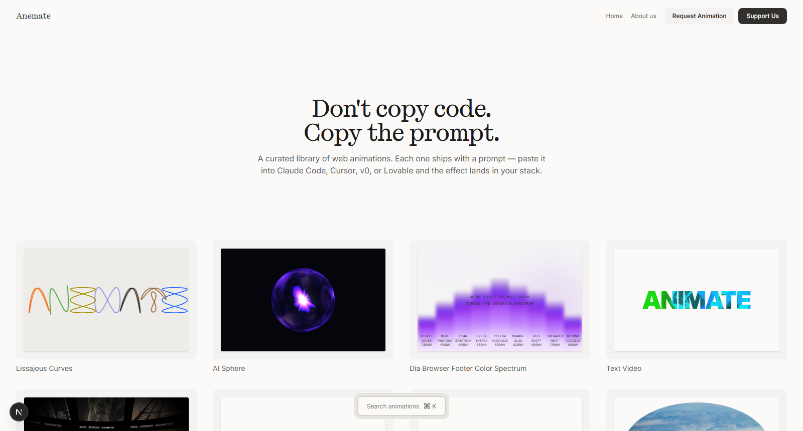

<p align="center">
  
</p>

<h1 align="center">Anemate.dev</h1>

<p align="center">
  <em>Don't copy code. Copy the prompt.</em>
</p>

<p align="center">
  <a href="#the-library">Library</a> ·
  <a href="#quick-start">Quick start</a> ·
  <a href="#stack">Stack</a> ·
  <a href="#architecture">Architecture</a> ·
  <a href="#adding-a-new-animation">Add an animation</a>
</p>

---

A curated library of web animations where the deliverable is a **prompt**, not a snippet. Every entry ships with a battle-tested prompt — paste it into **Claude Code, Cursor, v0, Lovable, or Bolt** and the AI regenerates the effect inside *your* codebase, with your conventions. The live demo proves it works; the prompt is the install.

## Why this exists

Most animation showcases hand you a CodePen link and wish you luck. That's fine if you hand-write your React. It falls apart in AI-first workflows, where pasting someone else's pen into v0 or Lovable produces half-broken output with mystery globals.

Anemate.dev treats the prompt as the product:

- **Self-contained** — one file, zero (or declared) dependencies, full source embedded. No "see the rest on my GitHub".
- **Mental model included** — every prompt explains *how* the effect works, so the AI (and you) can tweak it instead of cargo-culting it.
- **Proven live** — each entry runs as a real interactive demo on the site, not a looping GIF of better days.

## The library

Every card on the homepage is a **live, running component** — hover them, drag them, scroll them.

| Project | Technique |
|---|---|
| **Lissajous Curves** | The ANEMATE wordmark drawn as seven pure Lissajous figures — a verified 1:1 port of the cursor.com/compile hero engine. Phase-rewind intro, per-letter hover phase drift. Pure SVG + rAF, zero deps. |
| **AI Sphere** | True-3D plasma orb: glass fresnel shell around volumetric FBM gas, spinnable in real 3D, with a glowing flower-bloom core and 5 colour states. Three.js + GLSL. |
| **Dia Browser Footer Color Spectrum** | Scroll-revealed light spectrum — nine blurred gradient bars with live theme switching and randomize. GSAP. |
| **Text Video** | CSS `background-clip: text` — a video/GIF clipped to the letterforms of your headline. Pure CSS. |
| **Phantom Lab Grid** | Infinite WebGL grid of card tiles with momentum drag, distortion + vignette post-processing, per-tile click events. ogl + GSAP. |
| **Morphing SVG Mask Slider** | Image slider whose transition is an organic SVG mask morph. flubber-powered path interpolation. |
| **Liquid Reveal Hero** | SVG goo-filter blob (four spring-trailed circles merged by `feGaussianBlur` + `feColorMatrix`) used as a CSS mask. Inspired by landonorris.com. |
| **3D Perspective Highlight** | CSS `perspective` + `preserve-3d` card with per-frame lerped custom properties driving tilt and inline-highlight lift. |
| **Book Demo Button / Next.js Conf CTA** | Micro-interaction studies — the small stuff that makes a page feel expensive. |

### Spotlight: Lissajous Curves

The newest entry is a faithful decompilation of the **cursor.com/compile** hero. Every "letter" is a single parametric curve — `x = cx + A·sin(a·t + δ)`, `y = cy + B·sin(b·t)` — whose frequency ratio, phase and rotation are chosen so the raw math *evokes* the glyph. The engine port was verified **bit-exact**: loaded with the original COMPILE parameters, all seven SVG path strings hash-match the live site. Then it was re-parameterised to spell ANEMATE.

## Stack

| Layer | Choice | Why |
|---|---|---|
| Framework | **Next.js 15** (App Router) + **React 19** | Server components for the library shell, client islands for the demos |
| CMS | **Sanity** (Studio in `studio-animate.dev/`) | Project entries, video uploads; prompts override from the repo |
| Content | **Velite** (`content/`) | Typed markdown collections for blog / legal / sites / store |
| Styling | **Tailwind CSS v4** | The `@import "tailwindcss"` flavour, design tokens via `--color-base-*` |
| Animation | **GSAP · Three.js · ogl · framer-motion · flubber** | Each demo uses the lightest tool that does the job |
| Search | **Fuse.js** | `⌘K` fuzzy search over the library |

## Quick start

```bash
git clone https://github.com/smammar100/Anemateit.git
cd Anemateit
npm install

cp .env.example .env.local   # fill in your Sanity credentials
npm run dev                  # velite watch + next dev → http://localhost:3000
```

Sanity Studio runs separately when you need it:

```bash
npm run studio:dev           # → http://localhost:3333
```

> **Worktree tip:** `.env.local` is gitignored — fresh git worktrees need it copied from the main checkout or every route 500s on the missing Sanity project ID.

## Architecture

```
.
├── src/
│   ├── app/                      # Next.js App Router
│   │   ├── page.tsx              # Homepage — live-demo project grid
│   │   └── projects/[slug]/      # Detail page — demo + copy-prompt panel
│   ├── components/
│   │   ├── lissajous/  ai-sphere/  dia-spectrum/  phantom-lab-grid/ …
│   │   │                         # One folder per animation (demo + engine)
│   │   ├── landing/              # Homepage sections
│   │   └── projects/             # ProjectCard, grids, copy-prompt UX
│   └── lib/
│       ├── synthetic-projects.ts # Code-defined entries (no Sanity doc needed)
│       ├── sanity.ts · queries.ts· types.ts
│       └── utils.ts
│
├── prompts/                      # ★ Canonical copy-prompts, one .md per slug
│                                 #   The detail page prefers these over Sanity
├── content/                      # Velite collections (blog, legal, sites, store)
├── studio-animate.dev/           # Embedded Sanity Studio
└── scripts/                      # Sanity write utilities (sync, inspect, dump)
```

**Prompts are source-of-truth.** `prompts/<slug>.md` is read at request time (`loadPromptFile`) and wins over the Sanity `copyPrompt` field — so a prompt edit is a git commit, reviewable like any other code change.

**Synthetic projects.** An animation doesn't need a CMS entry to ship. Register it in `src/lib/synthetic-projects.ts` and it appears in the grid and gets a detail route — remove it once a real Sanity doc with the same slug is published.

## Adding a new animation

1. **Build the component** under `src/components/<slug>/` — the real engine plus a `<Name>Demo` wrapper with a `compact` mode for the card.
2. **Write the prompt** at `prompts/<slug>.md` — self-contained, full source embedded, "how it works" section, tweak knobs.
3. **Register it** in `src/lib/synthetic-projects.ts` (slug, title, description, technologies).
4. **Wire the surfaces** — card branch in `ProjectCard.tsx`, live-demo entry in `ProjectClient.tsx`, homepage list in `SitesPreview.tsx`, slug fallback in `projects/[slug]/page.tsx`.
5. **Verify** — `localhost:3000` card renders, `/projects/<slug>` demo runs, Copy Prompt copies the markdown.

## Scripts

| Command | Purpose |
|---|---|
| `npm run dev` | Velite watch + Next dev server on `:3000` |
| `npm run build` | `velite build && next build` |
| `npm run studio:dev` | Sanity Studio on `:3333` |
| `node scripts/syncPrompts.mjs` | Push every `prompts/<slug>.md` into its Sanity doc |
| `node scripts/listProjects.mjs` | List Sanity entries with prompt lengths |
| `node scripts/inspectVideo.mjs <slug>` | Which video asset a project references |

## Acknowledgments

- Design foundation: [Lexington Carbon](https://lexingtonthemes.com/templates/carbon) tokens and typography scale, heavily reworked.
- Lissajous engine: a study of the [cursor.com/compile](https://cursor.com/compile) event hero; curve technique reference from [jak_e's CodePen](https://codepen.io/jak_e/pen/ZvwgOg).
- Liquid Reveal technique: [Bruno Carvalho Feitosa's recreation](https://github.com/BrunoCarvalhoFeitosa/lando-norris) of the landonorris.com hero (OFF+BRAND).

## License

UNLICENSED — private project. Want to reuse a prompt or the scaffolding? Open an issue.
